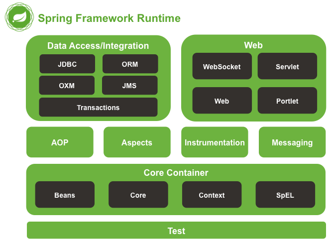
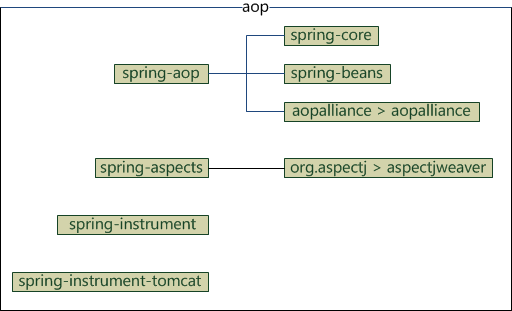
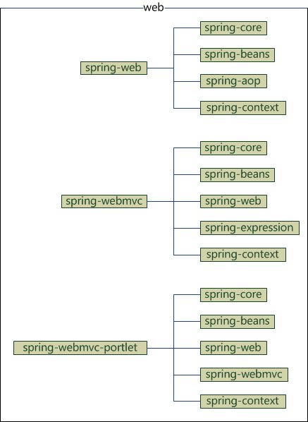
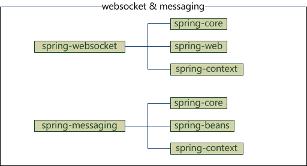

# spring-demo
## 基于spring 5.0.4

>5.x系列的新特性 https://www.ibm.com/developerworks/cn/java/j-whats-new-in-spring-framework-5-theedom/index.html

##一、 spring模块组成

由模块拆分出的jar包对应功能如下：
```spring-aop           spring-context-indexer  spring-instrument  spring-orm   spring-webflux  
   spring-aspects       spring-context-support  spring-jcl         spring-oxm   spring-webmvc  
   spring-beans         spring-core             spring-jdbc        spring-test  spring-websocket  
   spring-beans-groovy  spring-expression       spring-jms         spring-tx  
   spring-context       spring-framework-bom    spring-messaging   spring-web
```
###1. Core部分
  * spring-core：依赖注入IoC与DI的最基本实现
  * spring-beans：Bean工厂与bean的装配
  * spring-context：spring的context上下文即IoC容器
  * spring-expression：spring表达式语言
  
依赖关系：
 
 
###2. aop
  * spring-aop：面向切面编程
  * spring-aspects：集成AspectJ
  * spring-instrument：提供一些类级的工具支持和ClassLoader级的实现，用于服务器
  * spring-instrument-tomcat：针对tomcat的instrument实现

依赖关系:


###3. data access
  * spring-jdbc：jdbc的支持
  * spring-tx：事务控制
  * spring-orm：对象关系映射，集成orm框架
  * spring-oxm：对象xml映射
  * spring-jms：java消息服务

依赖关系：


###4. web
  * spring-web：基础web功能，如文件上传
  * spring-webmvc：mvc实现
  * spring-webmvc-portlet：基于portlet的mvc实现
  * spring-struts：与struts的集成，不推荐，spring4不再提供
  * spring-websocket：为web应用提供的高效通信工具

依赖关系：


### 5. spring-messaging
  用于构建基于消息的应用程序

依赖关系:


###6. test
  * spring-test：spring测试，提供junit与mock测试功能
  * spring-context-support：spring额外支持包，比如邮件服务、视图解析等
  
 
